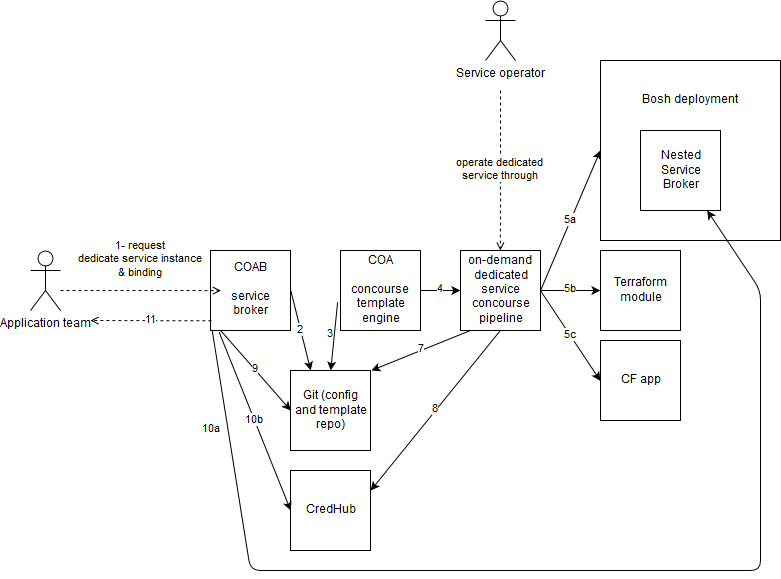

# cf-ops-automation-broker [](https://circleci.com/gh/orange-cloudfoundry/cf-ops-automation-broker)
On demand dedicated services through COA concourse pipeline engine

<a href="https://scan.coverity.com/projects/orange-cloudfoundry-cf-ops-automation-broker">
  
</a>

## Overview

COAB is a generic service broker which enables operators to provide on-demand dedicated services from available building blocks:
* terraform modules provisionning
   * [cloudfoundry resources](https://github.com/mevansam/terraform-provider-cf), such as cloudfoundry applications
   * [K8S resources](https://www.terraform.io/docs/providers/kubernetes/), e.g. through [K8S charts](https://github.com/mcuadros/terraform-provider-helm)
   * Saas resources such as [cloudflare](https://www.terraform.io/docs/providers/cloudflare/)
* existing bosh releases with service brokers offering shared service plans (e.g [cassandra-cf-service-boshrelease](https://github.com/orange-cloudfoundry/cassandra-cf-service-boshrelease/))

COAB leverages concourse-based pipelines to deploy and operate the dedicated resources, managed by the [cf-ops-automation (COA)](https://github.com/orange-cloudfoundry/cf-ops-automation) collaboration framework.

The following diagram illustrates COAB interactions


1. A user requests a dedicated service instance (or binding) through its prefered platform (CF or K8S service catalog) which in turn propagate the request to COAB as an [OSB API call](https://github.com/openservicebrokerapi/servicebroker)
2. COAB requests an on-demand dedicated pipeline to the COA templating engine, by writing to Git repos
3. COA templating engine reads the git repos 
4. COA generates on-demand pipelines that deploys and operate the requested dedicate service resources
5. The dedicated concourse pipeline provisions resources supporting the dedicated resource (in form of a bosh deployment, a terraform module, or a CF app)
7. the dedicated concourse pipeline records the outcome of the dedicated service in git
8. the dedicated concourse pipeline (and its underlying tools such as bosh director) records the credentials necessary to consumme the decicated service instance/binding
9. COAB pulls the dedicated service provisionning completion status from git
10. a) COAB delegates OSB API calls to nested service brokers, delegating credentials management to them
10. b) alternatively COAB fetches dedicated service credentials generated by the pipeline from credhub
11. COAB returns service instance/bindings to user


## Status

This project is still in a beta state providing POC broker releases for CloudFlare and Cassandra use-cases above. Next step is to generalize the approach.

## Getting Started

Deploy the broker as a CF app:
* The CF manifest.yml file would be available in [orange-cloudfoundry/paas-templates](https://github.com/orange-cloudfoundry/paas-templates) repo
   * The documentation reference for supported and required environment variables is in the [integration tests properties](cf-ops-automation-bosh-broker/src/test/resources/application.properties). 
   * The broker does not require stateful data service to be bound. 

### Configuring the service broker catalog

Use `CATALOG_YML` environment variable to set catalog config in a YAML format. See [catalog.yml](cf-ops-automation-sample-broker/catalog.yml) for a sample YML file which corresponds to the [Catalog bean](https://github.com/spring-cloud/spring-cloud-open-service-broker/blob/v1.0.2.RELEASE/src/main/java/org/springframework/cloud/servicebroker/model/Catalog.java).

## Authoring a new COAB-based service

Prepare a standard COA bosh deployment, see [COA documentation](https://github.com/orange-cloudfoundry/cf-ops-automation#template-engine-reference-documentation)

such as 

```
$ tree coab-depls/mongodb

coab-depls/mongodb
|-- deployment-dependencies.yml
`-- template
    |-- coab-operators.yml
    |-- add-prometheus-operators.yml
    |-- add-shield-operators.yml
    |-- mongodb-vars.yml
    `-- mongodb.yml
    
    
$ cat coab-depls/mongodb/template/coab-operators.yml 

#replace deployment name
- type: replace
  path: /name
  value: ((deployment_name))

#replace external host
- type: replace
  path: /instance_groups/name=mongodb-broker/jobs/name=route-registrar/properties/route_registrar/external_host
  # deployment name is of format model-deployment-short-alias + "_" + <service-instance-id>
  value: mongodb-broker-((deployment_name)).((!/secrets/cloudfoundry_system_domain))

```

COAB would generate the following for service instance provisionning/updates:

```
$tree coab-depls/m_f49911f7-b69a-4aba-afdf-23fd11014278

coab-depls/m_f49911f7-b69a-4aba-afdf-23fd11014278
|-- deployment-dependencies.yml -> ../../template/mongodb/deployment-dependencies.yml
`-- template
    |-- coab-operators.yml -> ../../mongodb/operators/coab-operators.yml
    |-- mongodb-vars.yml -> ../../mongodb/template/mongodb-vars.yml
    |-- m_f49911f7-b69a-4aba-afdf-23fd11014278.yml -> ../../mongodb/template/mongodb.yml
    `-- coab-vars.yml
    
```

The `coab-vars.yml` file contains the open service broker api standardized input for both service [provisionning](https://github.com/openservicebrokerapi/servicebroker/blob/master/spec.md#provisioning) and [update](https://github.com/openservicebrokerapi/servicebroker/blob/master/spec.md#updating-a-service-instance). The following example below shows a dummy example with a user passing arbirary params in a `cf update-service-instance` along with a service plan update. 

```
$cat coab-depls/m_f49911f7-b69a-4aba-afdf-23fd11014278/coab-vars.yml

---
deployment_name: "m_f49911f7-b69a-4aba-afdf-23fd11014278"
instance_id: "f49911f7-b69a-4aba-afdf-23fd11014278"
service_id: "mongodb-service_definition_id"
plan_id: "mongodb-plan_guid"
context:
  platform: "cloudfoundry"
  user_guid: "user_guid1"
  space_guid: "space_guid1"
  organization_guid: "org_guid1"
parameters:
  cacheRatio: 0.8642
  cacheSizeMb: 10
  slowQuery: false
previous_values:
  plan_id: "previous_plan_guid"     
```

Note: for security reasons, input validation is applied on the name and value of arbitrary params to prevent various injections (such as reading from credhub, spruce, file system injection, yml loading or reference expansions), and only so alphabetical characters, numbers are supported.

## Contributing

 ### Releasing

Prereqs: checkout the branch to release, and make sure it is up-to-date w.r.t. the github remote.
 
Releasing is made using [maven release plugin](http://maven.apache.org/maven-release/maven-release-plugin/) as follows :
 
 ```shell
 
 $ mvn release:prepare --batch-mode -Dtag={your git tag} -DreleaseVersion={release version to be set} -DdevelopmentVersion={next snapshot version to be set}
 
 # ex : mvn release:prepare --batch-mode -Dtag=v0.21.0 -DreleaseVersion=0.21.0 -DdevelopmentVersion=0.22.0-SNAPSHOT
 
 ```
 
 Circle CI build will proceed, and will trigger the execution of `mvn release:perform`, and upload artifacts to both github and https://bintray.com/elpaaso. For further details, see [release:prepare goals](http://maven.apache.org/maven-release/maven-release-plugin/prepare-mojo.html)

Following the release:
- edit the release notes in github
- clean up your local workspace using `mvn release:clean`

In case of issues, try:
* `mvn release:rollback` (which creates a new commit reverting changes)
    * possibly revert the commits in git (`git reset --hard commitid`), 
* clean up the git tag `git tag -d vXX && git push --delete origin vXX`, 
* possibly clean up bintray releases uploaded while github release failed
* `mvn release:clean`
* fix the root cause and retry.
   * possibly resume circle ci workflow from failed step (from the workflow page)
 
### Releasing a bug fix version

Say you have a bug in production against version 0.25.0 and need to create a bug fix version 0.25.1 without waiting for the next major(0.27.0), i.e. you need to create a 0.25.1 version out of 0.25.0

```sh
git checkout 0.25.0
git checkout -b 0.25.x
mvn release:update-versions --batch-mode -DdevelopmentVersion=0.25.1-SNAPSHOT 
git commit -am "prepare for poms 0.25.1-SNAPSHOT"
#add your fix or cherry pick it
#commit & push
mvn release:prepare --batch-mode -Dtag=0.25.1 -DreleaseVersion=0.25.1 -DdevelopmentVersion=0.25.2-SNAPSHOT
```

Then follow the same steps as for a normal release, picking up circle-ci remaining release part.


